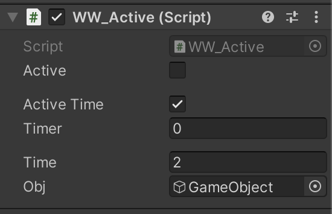

# Using

* You must first add scripts to the project

``` csharp

WW_Active ww_a = new WW_Active();

ww_a.True( this.gameObject ); // GameObject.SetActive( True );
ww_a.T( this.gameObject ); // GameObject.SetActive( True );

ww_a.False( this.gameObject ); // GameObject.SetActive( False );
ww_a.F( this.gameObject ); // GameObject.SetActive( False );

```

<br />

# On GameObject



<br />

``` csharp

// Active or no ( at start or show status )
Acive = bool

// Switch active?
// True or False
// Switch every N Time
Active Time = bool 

// Show time min = 0, and max = Time
Timer = float

// Wait N time before change  
Time = float

// Set GameObject for Switch
Obj = GameObject

```
